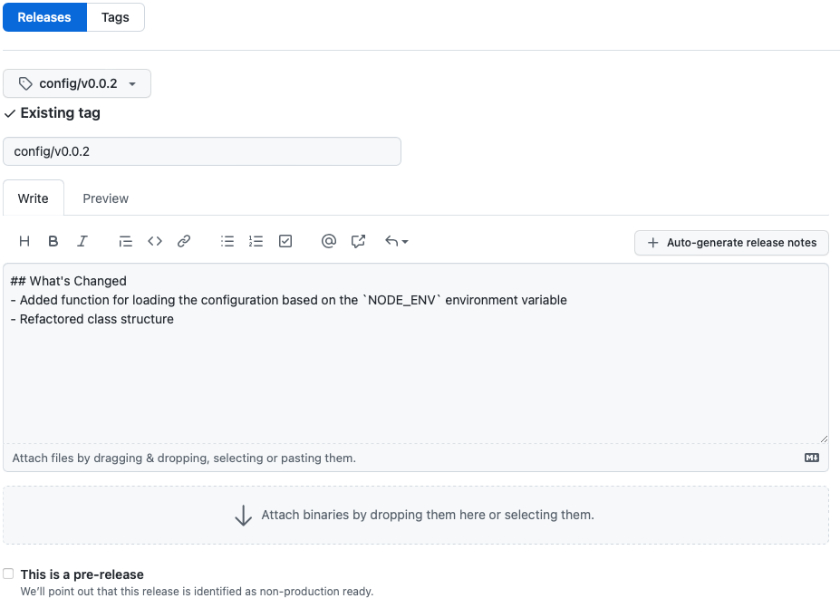

# @streamr/config

## Features
- Streamr Network development and production smart contract addresses
- Zero dependency

## Installing
Using npm:
```bash
npm install --save @streamr/config
```

## Examples
### Typescript
Import DATA token production Ethereum address as a variable in a Typescript project:
```typescript
import { config } from "@streamr/config"

const {
    ethereum: {
        id: chainId,
        contracts: {
            "DATA": dataTokenAddress
        }
    }
} = config
```

## Development
### Common Setup
Git checkout repository and change directory to it.
Install [NVM](https://github.com/nvm-sh/nvm) and run command in the repository root:
```bash
nvm use
```

Install Node modules:
```bash
npm ci
```

Change directory:
```bash
cd packages/config
```

### Programming
Start with [Common Setup](#common-setup) before continuing.

Run tests:
```bash
make test
```

Run lint:
```bash
make lint
```

Run build:
```bash
make build
```

Run clean:
```bash
make clean
```

#### Changing the config

After each update to the source config file (config.json) rebuild the package to validate integrity:
```bash
npm run build
```

### Publish Release
1. Start with [Common Setup](#common-setup) before continuing.
1. Login to Npmjs.com:
    ```bash
    npm login --registry https://registry.npmjs.org --scope @streamr
    ```
1. Run clean build, create a new release on Npmjs.com, update version in `package.json`, push a release commit, and tag it on GitHub:
    ```bash
    ./release.bash 0.0.2
    ```
1. Draft a new release on GitHub [network-contracts](https://github.com/streamr-dev/network-contracts/releases) repository with the generated tag `config/0.0.2`
	
## License
[MIT](LICENSE)

## Changelog

2.5.0: DataUnionFactory address in dev1 updated
2.5.3: ProjectRegistry address in dev1 added
2.5.4: MarketplaceV3 address in dev1 added
2.5.5: MarketplaceV4 address in dev1 added
2.5.6: ProjectRegistry, MarketplaceV4, RemoteMarketplace address added on live testnet
2.5.7: ProjectRegistry, ProjectStakingV1 address added on polygon
2.5.8: LINK, ProjectStakingV1 address added on dev1
2.5.9: MarketplaceV4 address added on polygon, RemoteMarketpalce address added on gnosis
2.5.10: Upgraded ProjectRegistry and RemoteMarketplace to ProjectRegistryV1 and RemoteMarketplaceV1

5.4.0: Removed Mumbai (ETH-790)
5.5.0: Refactored the config package, now config.json is available in the NPM package root in plain JSON
5.5.1: Added non-rate-limited apikey access for Amoy subgraph
5.5.2: Changed entrypoint ports
5.5.3: Polygon RPC endpoints updated
5.5.4: Peaq subgraph URL added
5.5.5: Peaq entrypoints set to same as current mainnet (polygon)
5.6.0: IoTeX deployment
5.7.0: IoTeX entrypoints and theGraphUrl added
